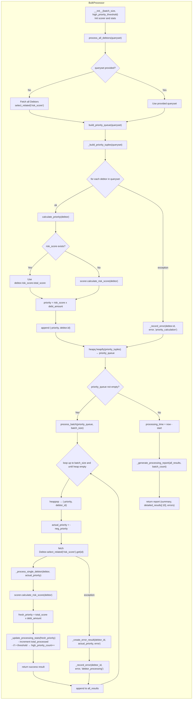

### BulkProcessor Flowchart

This diagram visualizes the control flow of `risk_service/bulk_processor.py`'s `BulkProcessor`.

```mermaid
%% Source of truth also in BulkProcessorFlowchart.mmd
flowchart TD
  subgraph "BulkProcessor"
    direction TB

    A["__init__(batch_size, high_priority_threshold)\nInit scorer and stats"] --> B["process_all_debtors(queryset)"]

    %% Build priority queue
    B --> C{"queryset provided?"}
    C -- "No" --> C1["Fetch all Debtors\nselect_related('risk_score')"]
    C -- "Yes" --> C2["Use provided queryset"]
    C1 --> D["build_priority_queue(queryset)"]
    C2 --> D
    D --> E["_build_priority_tuples(queryset)"]

    E --> F{"for each debtor in queryset"}
    F -- "ok" --> G["calculate_priority(debtor)"]
    G --> H{"risk_score exists?"}
    H -- "Yes" --> H1["Use debtor.risk_score.total_score"]
    H -- "No" --> H2["scorer.calculate_risk_score(debtor)"]
    H1 --> I["priority = risk_score x debt_amount"]
    H2 --> I
    I --> J["append (-priority, debtor.id)"]

    F -- "exception" --> K["_record_error(debtor.id, error, 'priority_calculation')"]
    J --> L["heapq.heapify(priority_tuples) → priority_queue"]
    K --> L

    %% Batch processing loop
    L --> M{"priority_queue not empty?"}
    M -- "Yes" --> N["process_batch(priority_queue, batch_size)"]
    M -- "No" --> Z1["processing_time = now - start"]

    N --> O{"loop up to batch_size and until heap empty"}
    O --> P["heappop → (-priority, debtor_id)"]
    P --> Q["actual_priority = -neg_priority"]
    Q --> R["fetch Debtor.select_related('risk_score').get(id)"]

    R --> S["_process_single_debtor(debtor, actual_priority)"]
    R -- "exception" --> T["_create_error_result(debtor_id, actual_priority, error)"]
    T --> U["_record_error(debtor_id, error, 'debtor_processing')"]

    %% Successful single-debtor processing
    S --> S1["scorer.calculate_risk_score(debtor)"]
    S1 --> S2["fresh_priority = total_score x debt_amount"]
    S2 --> S3["_update_processing_stats(fresh_priority)\n- increment total_processed\n- if > threshold → high_priority_count++"]
    S3 --> S4["return success result"]

    %% Collect results and continue loop
    S4 --> V["append to all_results"]
    U --> V
    V --> O

    %% After loop finishes
    Z1 --> Z2["_generate_processing_report(all_results, batch_count)"]
    Z2 --> Z3["return report (summary, detailed_results[:10], errors)"]
  end
```

Assets:
- PNG: `BulkProcessorFlowchart.png`

Embedded image preview:

